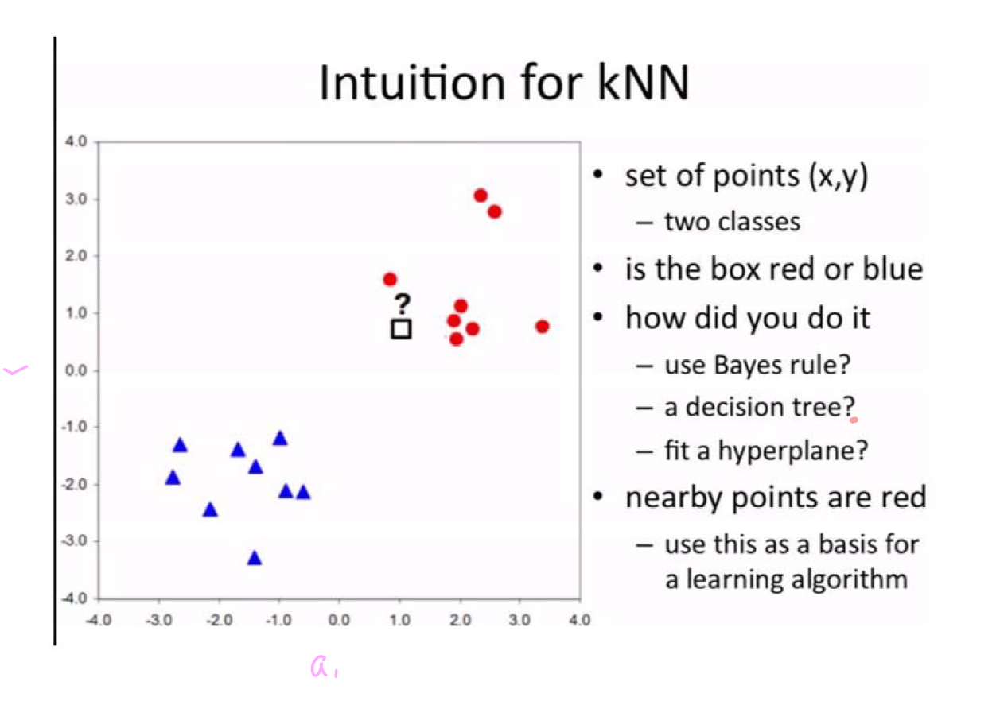
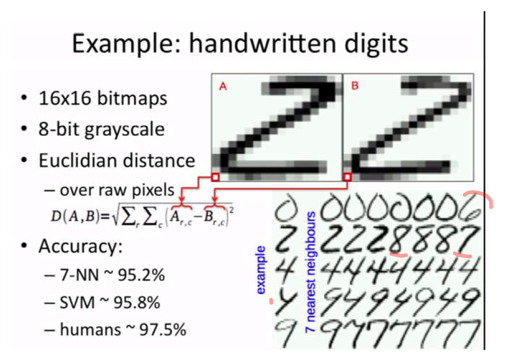
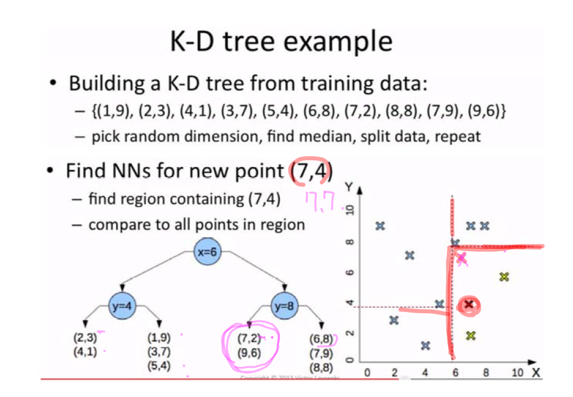
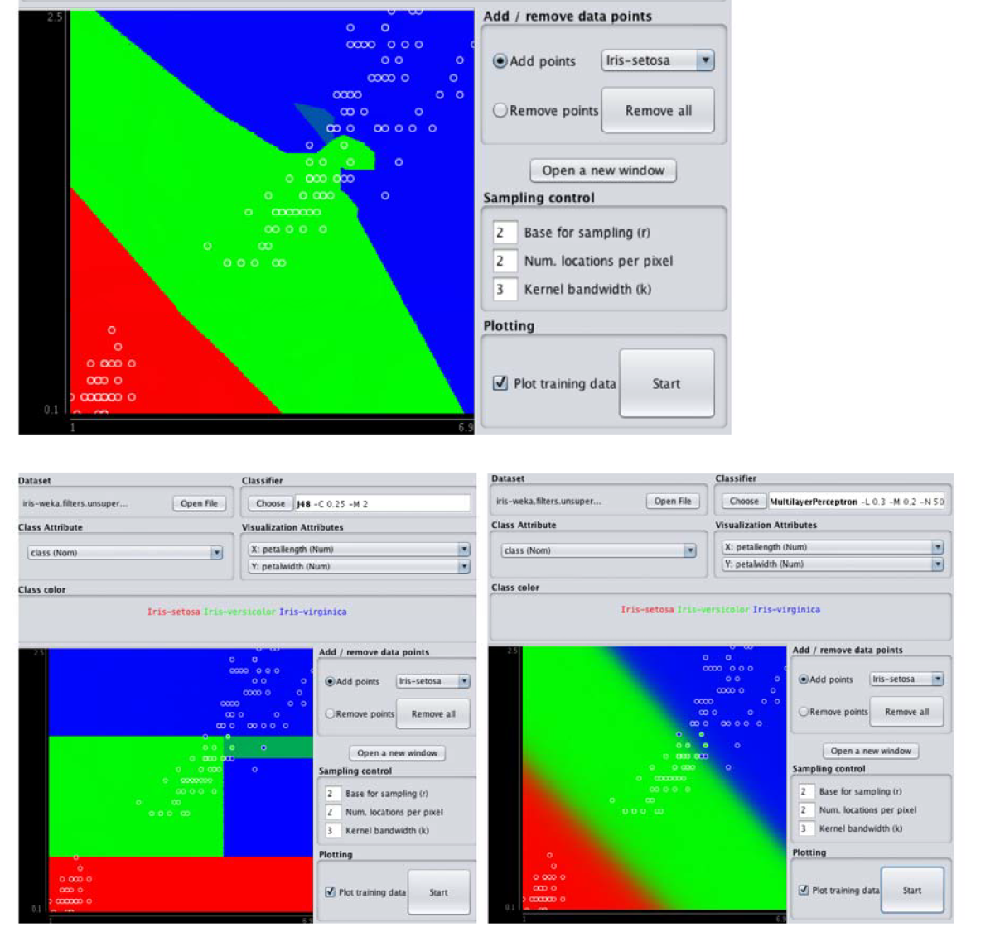

# machine learning

- local minima에 빠지는 것과 overfitting되는 것은 조금 다른 이야기이다.
- hidden units의 개수 (혹은 output의 개수)는

우리가 쓴 책이 뉴질랜드에서 Waikato대학에서 만들어졌는데, 농산물 프로젝트를 받았다.
자바로 오픈소스로 만든다. Weka를 만들어서 우리 책을 쓰기 시작했다.

날지 못하는 새 웨카.

간단하게 가볍게 테스트해보고 싶을 때 많이 쓴다.

Decision tree: boundary 가 사각형으로 만들어진다.

0과 1 사이에 숫자값이 다 섞여있다. Linear discriminant가 없기 때문에, 
만약에 이거 하나만 있다고 하면은 어느 지점이라고 하더라도,
베이지안처럼 1이 되는 확률적인 숫자는 아니다.

Hidden unit 하나를 썼다는 것은 일단 선 하나가 그어지고 선에 의해서 나눠지는 것이다.

Hidden unit을 4개를 쓰면 잘 된다. 1개를 쓰면?
하나를 써도 훌륭하네요.
10개를 쓰면? 많으니까 곡선형으로 만드나봐요. 이거를 다 어떻게 알겠어요?
시각적으로 feature가 2개라 잘 몰라요. 

Hidden unit이 없는 형태에서 output만 했을때는 boundary가 잘 보이지 않는 거죠.
Hidden unit이 있어야만 이런 선들이 만들어지기 시작한다.

자, 그 다음에 넘어가서, 각 hidden node는 하나의 linear bound를 만들고, 다양하게 조합시켜 nonlinear boundary를 만든다.
그리고 hidden layer가 하나면 convex layer를 만든다. 오목한 건 잘 만들지 못하고, layer가 늘어나야 오목한 걸 만들 수 있다.

많은 연구를 연구자들이 했는데, 실제적으로 지금도 쓰이지는 않고, 일단 하는 것은, early stopping도 한가지 방법이고, 100프로 될때까지 기다리지 않고, 
- error가 충분히 작으면 여기서 중단하자~ 이정도면 되는 것 같다.
- 아니면 RMS가 줄어드는게 보이는데 거의 안 줄고 거의 똑같이 가면 거기서 멈추거나~ 
- 아니면 number of epoch를 하는데 좋은 방법은 아니라고 생각한다. 어떻게 그걸 알아~ 
- 또다른 방법은 prune하는 것이다. input과 output사이에 예를 들어서 조금씩 늘려나갔다가 더이상 성능이 안 좋아지면 거기서 멈추는 것.
- 또는 아예 많이 놓고 시작을 해서 점점 줄어드는 거에요. 주욱 늘다가~ 더이상 확 줄지 않는 선에서 멈추고
- 랜덤으로 집어넣어서 제일 좋은 것부터 시작을 하는 것이다.
- 계속 우리가 한번 해보는 수밖에 없다. 이론에 의해 움직이는 것은 아님.
- Weka에서는 output number와 input number의 중간을 자동으로 집어넣어버린다.
뭐 이론이 있어서 그렇게 하는 것은 아니다.
도메인마다 다르고, 인풋 스페이스가 인코딩때문에 늘어나기도 하고 달라지기 때문에 알기가 힘들다.

노이즈를 가지고 트레이닝을 해본다. 아주 효과적인데, 논문도 하나 쓰셨는데, 트레이닝 데이터가 만약에 사선으로 있으면, 트레이닝 데이터 부근에 노이즈 데이터를 랜덤을 제너레이트 해서 데이터를 늘려서 해보는 것이다. 데이터 어그멘테이션이랑 비슷하다.
없는 데이터를 부풀려서 해보는 것이다.
적당한 데이터 균형을 맞춰보는 것이다.
연구주제도 많고, 기법이 많다. 그러면 성능이 확실히 좋아진다.

그 외에 여러가지, 네트워크 프루닝이나, 웨이트 디케이, 어느 웨이트는 변화도 없다~
그러면 별 역할을 안 하는 거기 때문에 버려버리고, 자동으로 프루닝을 할 수 있도록~

백 프로파게이션에서 텀을 집어넣어서 weight decay를 하거나 weight sharing을 할 수도 있다.
여러가지가 나와있습니다.

Optimal한 network complexity를 찾아야 한다. 교수님이 학생 때 실험하던 것들...

Neural network에 랜덤으로 집어넣어도 되구요, 웨이트를 해석하는 알고리즘도 만들어본다.

If then 룰을 가지고 다시 네트워크를 만들어본다. 자동으로...

이걸 가지고 해석하고 다시 이렇게 만들었더니 네트워크가 깔끔해졌다.

Restructuring process...

Promoter 데이터를 가지고 했는데, DNA로 promotion을 해주는 데이터에요. 구체적 x

이 데이터가 binary encoding으로 228-4-1 히든 노드 4개
921개이고...

rule-based 뉴럴 네트워크로 만들었고, 다시 논리적으로 합산시켜서 다시 만든 것이다.
이름을 어떻게 붙였냐면, ...

RBNN은 이걸 룰로 만든거고, layer는 늘었지만 connection은 줄었다.

ARBNN은 그래서 성능이 높아졌다. connection이 921보다 훨씬 줄어든 12개의 connection으로도 성능이 늘었다.
걱정이 되기 시작한다.
그냥 쓸모 없는 것들이 많은 거 아니냐? 작은 게 더 좋은 거 아니냐?
어떻게 해석했느냐.
간단한 방법을 썼다.
들어보세요.
알 필요는 없다.
Perceptron이 있고, weight값이 1,2,-5,3,0.5 등이 있다. 거의 안 바뀌는 것들이 많다.
그러면 별 영향을 안 미치는 거다. 합이 activation을 통과하는데 엄청난 영향을 준다.
저런게 생기면 안되니까, forgetting을 하니까, combination을 좋은 걸 찾아서 여기에 activate되거나 영향을 안 미치는 것을 제거시켜버리는 거다. 자동으로.

combination x1, x2는 1, 2 니까 합이 3이 들어가는데 다른 것들은 don't care니까
뭐가 들어가도 상관없다. 최대치를 집어넣어서, activate를 하게 하는지만 찾는 것이다.

그랬더니 이건 안되는데, 나만 되면 되는 것들이 바로 not x3같은 것들이다. x3만 아니면
나머지들은 모두 threshold가 -1이니까 다 된다. 모든게 activate된다. 아 그러면 딴거 볼 거 없이, not x3만 넣으면 되는 것이다.

여러 기법인 거고, 알고리즘에 집어넣었더니, 자동으로, RBNN으로 치환된다? ARBNN으로 바뀐다.

network 자체를 프루닝해서 자동으로 작은 폼을 찾아낸다. Network의 weight값을 자동 분석해서
줄인다 이런 내용입니다.

지도교수님이 Knowledge-Based Neural Network를 만들었는데 아무도 안 써요...
쨌든 뭐, 재밌는 연구를 했고, 데이터를 우리 수업 초반에 rule를 뽑아내는 걸 했는데,
굉장히 질적으로 차이가 많이 납니다.

Attribute를 하나씩 하나씩 independent하게 룰을 구했는데 마지막에는 합쳐져요. 굉장히 좋은 룰들이 나오고 성능이 좋아집니다.

책에서 보게 되면 4.6 챕터에 와 있고, MLP까지 같이 한 겁니다. 그 다음에 instance-based learning과 clustering 하면 됩니다. 20초 숨 돌리고~

## Instance Based Learning

책에서는 IBK라고 되어 있다.

learning인지는 잘 모르겠는데, classification기법으로 되기는 한다. 

나와 가장 가까운 것, 유사도가 높은 것을 찾는다. 어떻게 정의할 것이냐?
B가 나왔어. 아 나도 B구나 이렇게 찾는 것이다. 이게 IBK입니다. 문제가 있어요. 

- 데이터가 적으면 사용하기 힘듭니다. 
- 거리, 유사도는 어떻게 측정하는가? Euclidean distance를 쓴다.

## KNN, Clustering (K-means)

자세한 설명들은 유튜브에 설명들이 있다.

자, KNN, K개의 Nearest Neighbor구나, Neural Network이 아니구나~
착각하시면 안됩니다.

Distance구하는 방법:
Euclidean distance: 좌표계에서의 위치를 말하는 것이다.
좌표로 나의 위치가 정확하게 표현되는 것이다. 위치가 정확히 표현이 되니까 거리를 표현할 수 있는 것이다.
A부터 An까지~ 다시가 있다면

$$
\sqrt{(a_1 - a_1') ^ 2 + ...}
$$

일반적으로, 차이가 더 큰 것을 더 크게 만들어버릴 수 있어요. 나중에 합쳐버리면 차이가 나는 쪽의 영향이 더 커집니다. 너무 당연한 얘기

K개의 nearest neighbor를 찾아서 voting하자. Majority voting이라고 한다.

최종통합은 아무 구분이 안 됩니다. 400이 어디에서 영향이 많이 미쳤는지 우리가 알 수가 없습니다.
이것이 만약 나이고 연봉이면 연봉차는 실제로 100만원밖에 차이 안나는데 나이는 50살 차이가 나면
연봉 차이가 그냥 모든 걸 다 결정한다. 그래서 normalization을 해야 한다... 모든 것을 똑같은 간격으로 맞춰야 한다. 아니면 값이 큰 값에 좌지우지될 수도 있다.

Max of dimension이라는 기법도 있다. 가장 큰 것만 쓰게 하겠다.

Non Euclidean space라는 것도 있다. 좌표 공간이 아닌 것입니다. 거리르 어떻게 재는가?

대표적인 것이 cosine vector.

문서분류 기본적 방법이 이런 것이다. LCS(x, y) 등... 반갑다! Longest Common Substring

혹은 같은 단어가 몇번 나왔는지 개수를 세서 유사도를 측정

2, 0, 3, 1 과
5, 3, 2, 0 은
많이 다르다.

|2   |0   |3|1
|---|---|---|---|
|5    |3   |2|1

$$
D(x, y) = 1 - \frac{X Y}{|X| |Y|}
$$

$$
D(x, y) = |x| + |y| - 2 |LCS(x, y)|
$$

질문 있나요?

  

Bayesian 을 써야 하나 hyperplane을 써야 하나... 

Intuition을 가지고 해보면

  

Voronoi Tesselation이라고 한다. 자기 영역이 나눠진다. 선을 긋고 직교하는 선을 긋는 것이다.

Non-linear하다. 

K개를 어떻게 고르는가?
K를 1개만 고르면 어떻게 되는가?
K개를 N개를 고르면 어떤 결과가 나오는가? Zero-rule 이랑 같다고 보면 되는가? P(y), 즉 프라이어 프로바빌리티가 나오네요. 
결과가 그렇게 나오죠..

### Algorithm
  

### Example: handwritten digits

  

0과 6이 헷갈린다.
4와 9가 헷갈린다.
9와 7이 헷갈린다.

이 정도면 훌륭하다~

자 그 다음에 처음으로 다시 돌아가면~
2번째 문제가 뭐였냐면, 

k개를 odd로 해야 싸우지 않는다.
같은 것이 나오면 어쩔 것인가?

### 빠르게 하는 법
Training: O(1), but testing O(nd)

Reduce d: dimensionality reduction

### K-D tree example

Building a K-D tree from training data:

- {(1, 9), (2, 3) ...}

pick random dimension, find median, split data, repeat

...

Dimension이 2개니까, 영역이 4그룹으로 나뉜다.

  

아까 봤던 weka를 봅시다. k를 1로 했어요. 제일 가까운 걸 찾으니 결과가 이렇게 나온다.
조금 문제가 있었는데 그것만 저렇게 찾아서~, 오버피팅이 되었다고 해야 하나 말아야 하나... 하는 고민이 있어요.
어쨌든 모양이 저렇게 나오네요. 데이터에 굉장히 민감하게 반응을 합니다.

  

밑에 있는 두개는 디시젼 트리와 퍼셉트론이다.

하여간 그래도 성능이 좀 떨어지기는 한다.

#### Quiz:
Which of the following option is true about k-NN?
- It can be used for classification
- It can be used for regression
- It can be used for both classification and regression

Ans: the third
3개를 찾아서 평균을 내어버리는 식으로 하면 되기 때문~ 와우 천재적

다음이 바로 clustering을 배울 거에요.

Clustering도 KNN이랑 비슷해요~ Instance를 통해서 grouping하는 거에요. 수고하셨습니다~

