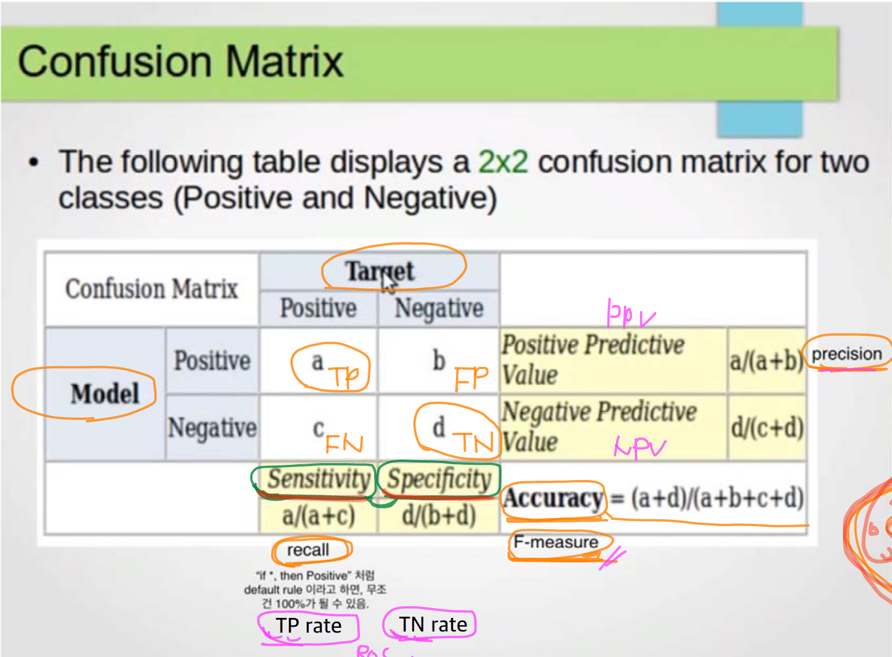

# 공정성

인공지능들이 신뢰성, 부정확성...

MIT 흑인 연구원이 건물 인식, 등록을 해야 하는데, 자기 얼굴이 인식이 안 되는 것을 발견. 

그 전에는 이런 문제를 생각을 못했는데 거기서 문제가 커지기 시작함.

여러개를 테스트하면서 등록에 실패. 하얀 가면을 얼굴에 씌웠더니 바로 등록이 됨.

오픈 소스 프로그램을 들어가서 봤더니 훈련 모델이 남성 백인 위주로 훈련이 되었음을 알 수 있음.

## 이유가 뭘까?

- 데이터에 문제가 있었다.
- 최적화 알고리즘에 문제가 있었다.

제가 처음에 미국에서 맥도날드를 갔더니, 동양인을 처음 봐서 창문에서 구경하고 있었다.

학교의 행정실에서 나인지 구분을 전혀 못한다.

대출받을 때... 

## 신뢰성, 공정성, 윤리성, 안전성

## 안전성

자율주행 자동차가 들어가게 되면서, 컴퓨터 비전 테스트를 해보는데, 자동차가 가다가 30 mile stop sign이 있잖아요.
그 싸인에다가 라미네이터를 몇 개 붙였더니 어떻게 얘가 인식을 하냐면 그것을 80이나 100으로 인식하는 대참사...

데이터의 문제인가, 최적화하는 알고리즘의 문제인가?

## 인공지능 모델의 안전성은 어떻게 평가할 것인가?

기존에는 신뢰성만을 위주로 판단했다.

유럽에서는, EC, 유럽의 인공지능 윤리에 대해 연구하는 기관에서는
단순히 신뢰성뿐만이 아니라 공정성과 안전성도 통과를 해야 한다는 규정을 만들고 있어요.

## Evaluation

Training set, test set, validation set

- big data set ...
- middle size data set ...
- small size set ...

다양한 모델 (DT, NB, LR, MLP)...

무슨 모델이 나을지는 우리가 테스트를 해보면 됩니다.

아, 이거가 성능이 좋으면 이건 non-linearity를 가지고 있나 보다~

또는 parameter 값에 따라서 달라질 수도 있어요. 히든 유닛의 갯수를 몇개를 쓰는 게 좋은가?

그리고 feature에 따라서...

## test 방법

1. training set으로 test? 말도 안된다.

    - 안됨. Generalization 성능 못봄. Overfitting 될 가능성 높음

    - Test 는 training에 사용하지 않아야 함.

2. Holdout
    - Available dataset return

지금 나오는 모든 기법들은 variation 관점에서 얘기를 한다.

## Variation

수학 공부를 하는데 이 학생은 variation이 크다. 90점도 맞고 40점도 맞는다.

정확한 variation을 알기 위해서는 Holdout을 여러번 해야 한다.

### K-fold Cross Validation

- holdout을 random으로 반복 x. Systemic 하게 한다.

데이터셋을 10개로 나누고 9개를 가지고 트레이닝하고 1개로 테스팅한다.
그 다음에는 두번째걸 가지고 테스트...
이걸 10번을 반복한다.
모두 다 테스트에 1번씩은 사용되고, 모든 데이터셋이 한번씩은 트레이닝에 다 사용된다.

결과는 92, 93, 96 ... 평균은 94

성능이 어떨 것이다~ 라고 추정하기 위한 거지, 사용하는 것은 아닙니다.

이렇게 해서 돌아가면은 이렇게 되죠~

- K-fold
  - Repeat
  - Variation of the estimate 을 줄인다
  - Stratified cross validation 은 더 줄인다.
    - stratified CV: ensures right proportion
    - repeated ...

수업노트 참고

## Bootstrapping

https://youtube.com 동영상도 있네요~ 참고

부트스트래핑은 이제 부츠의 스트랩을 말하는데, 여러분 나이 정도 되었을때, 카우보이 부츠를 산 적이 있어요.

잠이 안 와요. 너무 이쁘게 생겼어요. 특히 저 부트스트랩이 정말 멋져요.

근데 사서 신을 일이 없어요. 이 나이 되도록 가지고 있었어요. 또 신으니까 굽이 딱딱 소리가 나요.

바닥에 소리가 나요. 멋있잖아요.

근데 어디에 신고 갑니까? 그래서 그것을 당근마켓에 올렸어요. 한시간 만에 바로 연락이 왔어요.

20대 중후반의 남자가 오토바이를 타고 왔어요. 바로 가져갔어요. 그 친구가 이 부트스트랩을 너무 좋아했어요.

???????????????????????????????????

데이터 샘플링하는 방법이에요.

일부는 트레이닝하고 일부는 테스팅한다고 하면은 variation이 굉장히 커지잖아요.

어떻게 하냐면, n개의 데이터가 있어요. n개를 with replacement로 뽑습니다.

그러면 똑같은 게 반복되어서 나올 수도 있어요~. 2, 2, 6, 6 ...

이것을 몇번을 반복하냐면은 n번을 반복합니다.

이론적으로 그럼 어떻게 나오냐면, 전체에서 어떤 것이 뽑힐 확률은 전체분의 1입니다.

뽑히지 않을 확률은 1-n분의1이구요, 이걸 n번 반복하니까 n승...

exponential이네?

0.36은 여기에 들어가지 않고, 0.63은 여기 들어올 가능성이 있,...

그래서 평균적으로 따지면 여기에 들어온 것을 가지고 트레이닝을 하고, 여기에 들어오지 않은 것을 가지고
테스팅을 하는 방식이에요.

그걸 n번을 반복을 합니다. 이 방식인데~

책에 보면 0.632 bootstrap 이라고 얘기합니다. 그 이유가?

## 시험문제: 저 결과를 보고 공정성, 편향성에 대해 논하여라.

Detailed Accuracy by class

TP rate, FP rate, precision, recall, f measure , ROC Area Curve

등등...

## Simple Accuracy

Accuracy = (No. Samples Predicted Correctly) / (Total No. of Samples)

Training set 을 가지고 모델을 만들었어요. Test 데이터를 가지고 모델을 봤더니 97프로가 나왔어요.

클래스가 2가지에요. A 클라스 B 클라스를 판정하는 모델인데 97프로가 나왔어요. 그래서 stratified를 가정을 하는 거에요.

저거는 일반적으로 balance가 잘 갖춰져있을 때 이게 97프로라는 게 의미가 있어요. Unbalance라면 믿지 못합니다.

## Confusion Matrix

책들을 보면

Actual Data
Predicted Class

True positive
False positive
True negative
False negative

  

내가 검색엔진을 만들었다. 고려대학교라고 쳤다.

그러면 전체 인터넷에 고려대학교가 이렇게 많은데, 내가 찾은 거가 절반이다. 그러면 만약에,

내가 머리를 써서 진짜 정확한 3개만 찾으면 Precision은 100이다. 대신 나머지 9900개는 못 찾는다.

하지만 우리는 최대한 고려대학교를 많이 찾는 동시에 Precision도 높고 싶다. 그럴때 Recall을 쓴다.

두개를 같이 보기 위해 F measure를 쓴다. 

그 다음에 의료 정보에서는 또 다른 관점이에요.

Positive 라고 이게 전체 지금 세상에 있는 걸린 사람들 중에서 몇명을 찾아내는가?

전체 중에서 몇명을 찾아내느냐가 중요하다.

다양한 관점으로 볼 수 있다.

위 그림이 다 적어놓은 건데...