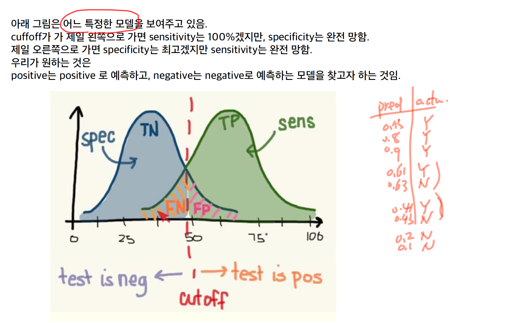
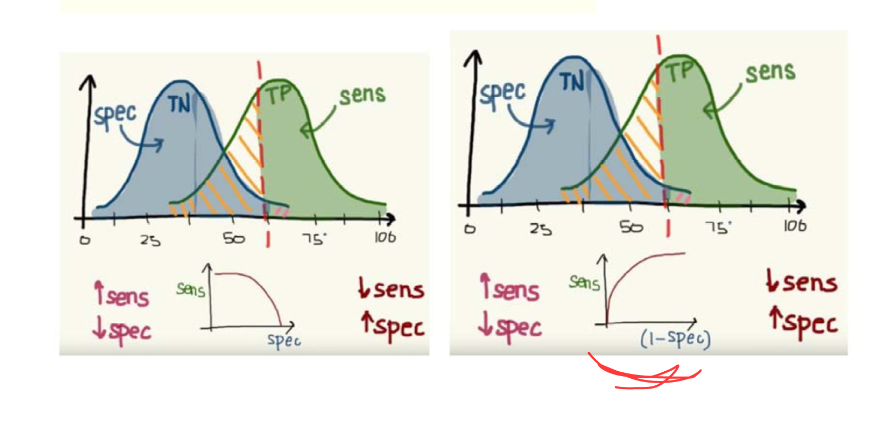
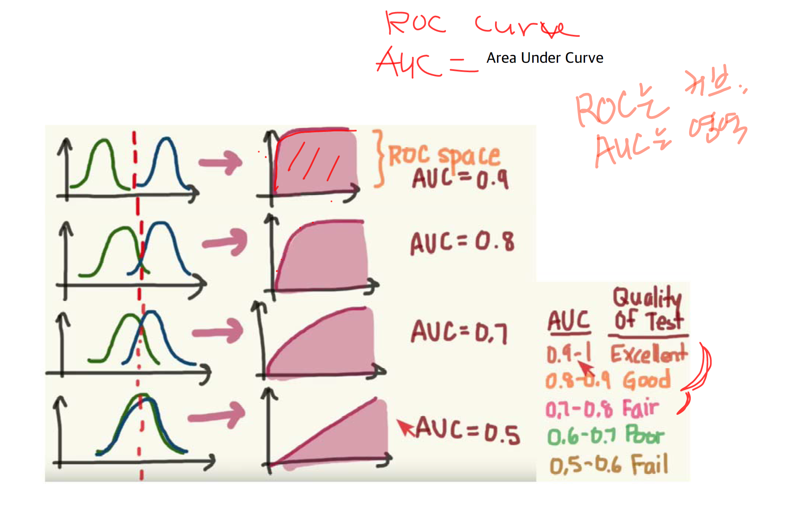
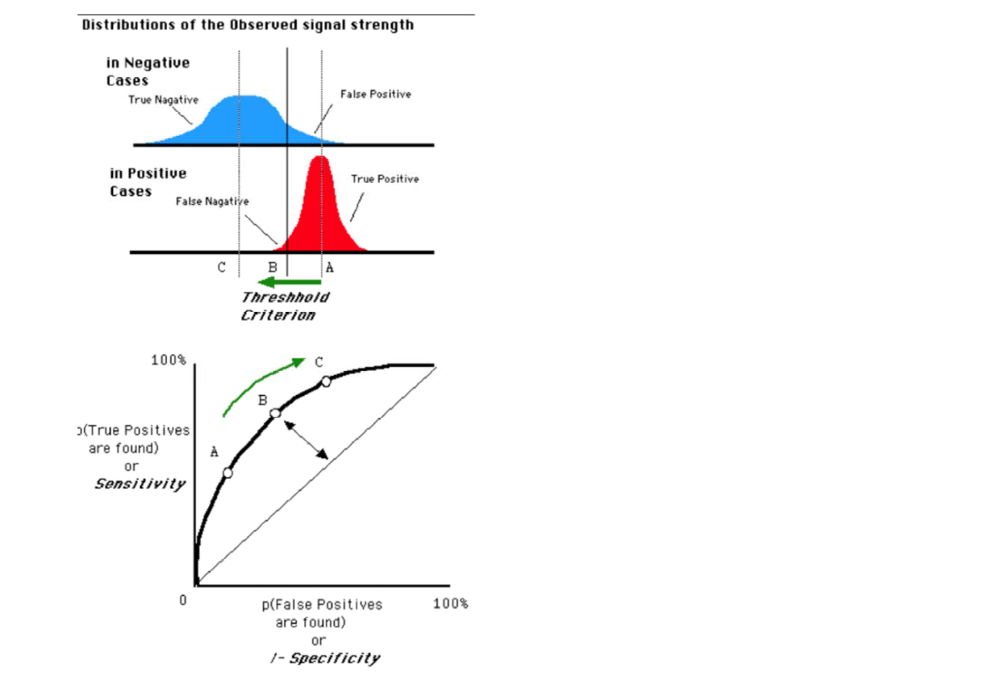
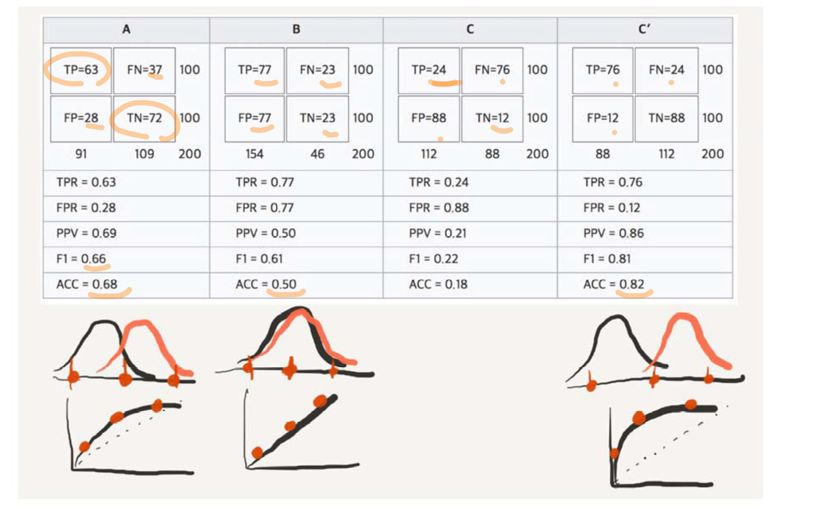

# 성능 평가

## Accuracy = (TP + TN) / (TP + FP + FN + TN)

만약 데이터가 biased 되어 있을 경우, 그냥 zero rule 을 써버리면 accuracy가 높게 나온다.

## Sensitivity

TP / (TP + FN) = TP rate = recall

## Precision

TP / (TP+ FP) = precision

이걸 높이는 방법은 매우 보수적으로 판단하면 된다. 매우 확실한 친구들만 true라고 선언하면 된다. 하지만 이럴 경우, recall의 수치는 바닥을 찍을 것이다...

## F1 score

F1 score = harmonic mean of precision and sensitivity

논문을 쓸 때는 F1 값을 바로 쓴다.

## Precision에 조금 더 가중치를 많이 주고 싶다면?

암이 진짜인지 아닌지 판별하는 가중치를 더 주고 싶다면?

$$
\beta
$$

를 사용하면 된다.

$$
F_\beta = \frac{1}{
    \beta * \frac{1}{\text{Precision}} +
    (1 - \beta) * \frac{1}{\text{Recall}}
}
$$

## Two confusion matrix

아니 우리 이거가 실제로 default보다 좋은가? 하는 생각을 할 수도 있다.

랜덤으로 아무렇게나 해서 맞추면 baseline보다 얼마나 좋을까? 언밸런스가 많으면 그 언밸런스 때문에 확률이 올라갈 수가 있다. 그래서 랜덤으로 맞추는 걸 기반으로 해서 해보겠다.

전체 중에서 랜덤으로 하는 것. 맞춘 것 중에서 랜덤으로 하는 것을 빼서 계산을 합니다.

## Kappa statistic

## Classification

- Perceptron
- MLP
- Logistic Regression

같은 경우에는 output 값이 0~1이 나오는데,
우리는 binary classification을 하고 싶다. 즉, A클래스 혹은 B클래스!

Confusion matrix가 달라지잖아요? 그러면 threshold는 언제든지 나의 경영 전략에 따라서
바뀔 수가 있는 건데, 이 모델과 저 모델 중에서 어느 것이 좋은지 판별할 때는
variation이 더 적게 해서 판별할 필요가 있구요.
Threshold가 변해서 confusion matrix가 변할 수 있는데,
그걸 다 감안해서 이 모델을 평가하는 방식이라고
볼 수가 있어요. 거기에 따라서 confusion matrix가 바뀔 수 있죠.
그때 그걸 다 체크를 해서 sensitivity와 speci? 로 측정을 해서 보는 겁니다.

어떻게 그래프가 나오냐면, sensitivity와 specificity는 약간의 trade-off
가 있기 때문에, 그림이 볼록하게 나옵니다. 이걸 ROC 커브라고 하구요, 이걸
이제 저희가 쓸게요.

- ROC:
- AUC: Area under curve

다양한 threshold가 있더라도 거기에 민감하게 반응하지 않고...

제가 학생 때는 다 accuracy를 썼는데, 이제는 주로 F값과 AUC 가지고 성능 평가를 합니다. 대부분이 그런 것 같아요.

## Cost sensitive 스킵

## ROC and AUC

큰 개념은 다 설명을 했어요. Threshold에 따라 성능이 달라질 수 있고, confusion matrix가 달라진다.
하나의 그래프로 요약한다.
Variation이 더 적은 모델을 상호 비교하는 것을 ROC커브라고 한다.

  

  

만약에 나의 모델이 

  

이 맨 위같다면 정말 좋은 모델이죠?

맨 밑에꺼면 전혀 구분을 못해서 안 좋은 모델이에요.

일반적으로 AUC가 0.9를 넘어간다면 Excellent 한 거에요.
0.5-0.6 이라면 좋은 모델이 아닌 거에요.

그렇게 판별을 합니다.

2차 세계대전에서 레이더의 spot이 적군인지 아군인지 판별하는 receiver operator병의 curve. 1970년대에는 의료 정보 분석에 사용.

WWII - Signal Detection Theory

  

위로 올라갈 수록 굉장히 안정적으로 움직이는 거구요.

그림에 보면은 아주 다양한 시뮬레이터가 있습니다. 시뮬레이터 그림을 찍어놓은 거구요. Sensitivity, FPR, TPR 등을 볼 수가 있습니다. 그리고 이 그림도 보게 되면 4개의 다른 confusion matrix 를 보고 있는데, 20초간 보세요.

  

사실 positive negative 가 100 100 인데, 이렇게 나눠져 있어요.

accuracy를 보면, 3번째는 정 반대이고, 마지막이 성능이 좋다.

F1 값을 보면 역시 마지막이 제일 좋게 나온다.

이 그림은 근데 AUC값이 없네...

쨌든 두번째 그림은 AUC값이 별로 안 좋다. 합쳐져 있기 때문에...

여하튼 그렇게 찾을 수가 있다~

## 의료 정보에서의 활용

우뇌를 사용하세요~

## 마지막 페이지

레이더의 적군은 다 잡아야 하잖아요. 있는 건 다 잡아야 하니까 Precision을 쓰는 거구요.

마케팅에서는 Lift chart처럼 cost를 고려를 해야 하구요.
보는 관점들이 달라지는 것을 알 수 있습니다.

하나 더 추가하면, 지난번에 얘기했었던, 최근에 등장하고 있는 공정성에 대한 measure들도 1~2년 사이에 논문이 많이 나오고 있어요.

공정성 승률이 92% 되어야만 사용할 수 있다, 그런 논문들이 나오고 있어요. 공정성 measure는 어떻게 측정할 것인가? 구글에서 페이스북들에서 제품이 나왔는데, threshold를 변한 것처럼, data의 balance를 조정했을 때, variation이 적게 나와야 합니다.

사람을 대학 입학할 때 수능 성적만 가지고 평가할 수도 있지만, 인성, 창의력도 보고 기준이 다 다르잖아요. 우리가 이제 그 기계학습 모델을 볼 때도 accuracy 하나만 봤어요. 앞으로도 계속 나오게 될 겁니다. 기대하는게 달라져요.

## 다음 시간

SVM 볼게요.