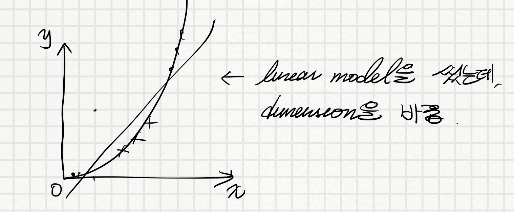

# SVM

## Support Vector Machine?

- linear model
  - maximum margin classifier => input space를 트랜스폼 시킨다.
  마치 non-linear 경계인 것 처럼 만든다.
  - support vector classifier (soft margin classifier)

1차원 데이터가 있다고 해보자. 5가 있고, x가 있다고 하면, linear로 boundary 만들기
힘드니까, 2차원으로 바꾼다.

> 천재적인 아이디어!

예를 들어 이것을 2차원으로 바꾸면 x를 제곱시키는 거에요. 어떻게 돼요?

  

퍼셉트론을 배우면 이제 classifier가 linear model이기 때문에, delta rule을 적용해서
error rate를 계속 계산한다. 여기서도 찾았으면 계속 옮겨가다가 만약에 적합한 지점에 딱
오면, training이 끝나버려요. 그런데 사실 제가 보기에는 아무거나 다 될 수 있어요...

제가 보기에는 가운데를 지나가는 게 가장 좋아보이는데, 모델은 경계에 있을 수도 있다...

소프트마진은 어떻게 구할래? 모든 데이터들의 pair의 계산을 합니다. 그것을 우리가
support vector classifier라고 합니다.

## support vector classifier

이걸 만드는데 사용된 pair들을 support vector라고 합니다. 모든 pair를 비교를 합니다.
개념적으로만 설명드린거지, 수학적으로는 매우 복잡합니다. 최종 결론은 뭐냐면,

아, perceptron같은 경우는 조건을 만족하는 linear model이 굉장히 많이 나올 수 있지만,
support vector classifier는 딱 하나만 나옵니다. 그리고 그 하나는 제일 중간에서
양쪽을 제일 잘 정리하는, margin이 높은 그 classifier를 하나 만듭니다.

이게 차원이 많아지면 hyperplane이라고 합니다.

Support vector classifier는 마진은 가장 넓게 하는, maximizing하는, 성능을 max한다.

그렇게 해서, 아까 설명을 했지만, 현재까지는 linear classifier인데, 어떻게 non-linear?

XOR 문제를 봅시다.

이것을 제곱을 해버리면 어떻게 됩니까?

+4 하고 -4 하고 2개로 나눠집니다.

> 우와....

하나의 아이디어입니다.

이렇게 polynomial무언가를 하면 linear classifier로 할 수도 있다.

이걸 우리가 어떻게 할까요? x 제곱? x 세제곱? 뭐가 나올까요?

두개가 있으면 x1 * x2**2 가 낫나요? 이걸 어떻게 알죠?

Cross validation으로 할 수 있습니다. 다 해봅니다. 어느 것이 좋은지 판단합니다.

예를 들어서, cross validation을 할 때, 어떤 3가지 형태로 3가지로 쓰인다.

그 중 하나가 이 모델이 나은지를 판단할 때 하면 좋다. Parameter를 어떻게 하는지~

Hidden unit의 갯수가 뭐가 나은지를~

Dimension이 2가 나은지 뭐가 나은지를 cross validation할 수 있습니다.

개념은 간단하지만 숨겨진 개념들이 많죠? 굉장히 여러가지 수학적 얘기들이 많이 있습니다.

Polynomial kernel의 형태이다.

대학원 때 support vector machine이 처음으로 논문으로 나왔습니다. 책이 이렇게 두꺼워요.

랩에서 구현도 실제로 많이 했었구요. 뜨는 라이브러리였어요. 조금 관심이 있으면 수식을 파고
알아볼 수 있지만, 수업에서는 개념적으로만 배울 겁니다.

x1, x2, \sqrt(2)x1x2

이런 구조로 되어있습니다.

Support vector machine은 지금은 별로 안 쓰죠.
근데 기계학습 역사를 되돌아보면 굉장한 역할을 했습니다. 1980년대에 MLP가 나오기 시작하며
해결하기 시작했습니다. 근데 문제가 생겼어요. 무슨 문제가 생겼냐면, Character recommendation,
그리고 image, text 인식에 문제가 생기기 시작했어요. 그래서 답보 상태였는데, svm이 나오면서
그 문제를 해결했습니다. 그때부터 MLP보다는 SVM이 낫지 않나? 하고 이동을 하기 시작했는데,
성능이 80퍼에서 85퍼 올라가는 정도였는데, 갑자기 SVM때문에 괄시를 받던 MLP를 보완한
Deep Neural Network가 생기기 시작했고, 그때부턴 deep learning이 좋아요.

여전히 SVM은 테스팅해봐야 하는 것들 중 하나입니다.

Input space를 변환하면 이제 완전히 perceptron 방식하고는 다른 방식이니까요.

한 20초만 숨을 돌리고 그 다음부터 해볼게요.

feature가 전부다.

## 5. Feature selection and extraction

모델을 사용하지 못하게 되죠. irrelavent한 feature들.

- irrelevant features
- redundant features

없애면 성능이 확실하게 좋아집니다.
어느것이 좋은 feature인지 찾아내는 방법을 기계학습적인 방법으로 연구를 하기 시작했어요.

Weka로 돌린 실험이 하나 있는데, feature를 더 적게 했더니 glass.arff 에 대해서
다 고려했더니 67%
cross validation을 통해 accuracy를 찾았더니 69%

어떻게 저럴 수가 있지? 신기

Feature subset selection: finds a subset of original features without new features

Feature extraction: extracts a set of new features from the original features

Feature subset selection

- wrapper
- embedded
- filter

상식적으로 생각하면 된다.

### Filter

feature가 f1부터 fn까지 있다.

각각을 어떻게 평가하는가?

각각의 기여도를 어떻게 판단할 수 있을까?
그 모델이 뭐든지 상관없이...

> 그 피쳐를 빼고 모델을 돌려보면 되지 않을까? 맞다!

그러면 순위가 나옵니다.

순위를 매겨서 1등부터 n등까지 쭈욱 나열합니다.

우리 학교의 대표 선수를 경시대회에 보내야 하는데 n명을 다 보낼까? 2명만 보낼까?

평균값으로 결정을 해야 합니다.

그거의 평균값이 우리팀의 점수면 어디서 짤라야할까 고민입니다.

적당한 선에서 search를 해서 보냅니다.

이게 필터방법입니다.

### Wrapper

Wrapper는? 1등부터 상위를 가지고 팀을 만들면 과연 좋은 팀일까?
그렇게 하지 말고 모든 팀의 조합을 다 만들어보자!
> Superset?

상호작용을 했을때 더 좋은 결과를 내는 것들이 많거든요. 모든 집합을 다 테스팅해봅니다.

제일 좋은 집합을 찾아내는 방법을 얘기합니다. Complexity가 엄청 복잡합니다.

제일 앞쪽의 search 알고리즘이 되어버립니다.

### Embedded

Embedded 방법은 이 feature들을 다른 모델, decision tree라던가 다른 모델에서 끄집어내는
방법입니다.

한번 봅시다. Filter 방법은 feature들을 individual하게 measure합니다.

- information gain
- distance
- entropy

Weka같은 경우는 Classification, Association, Select attributes (feature selection) 같은 게 있어요.

WrapperSubsetEval <- best first search

답을 냅니다.

