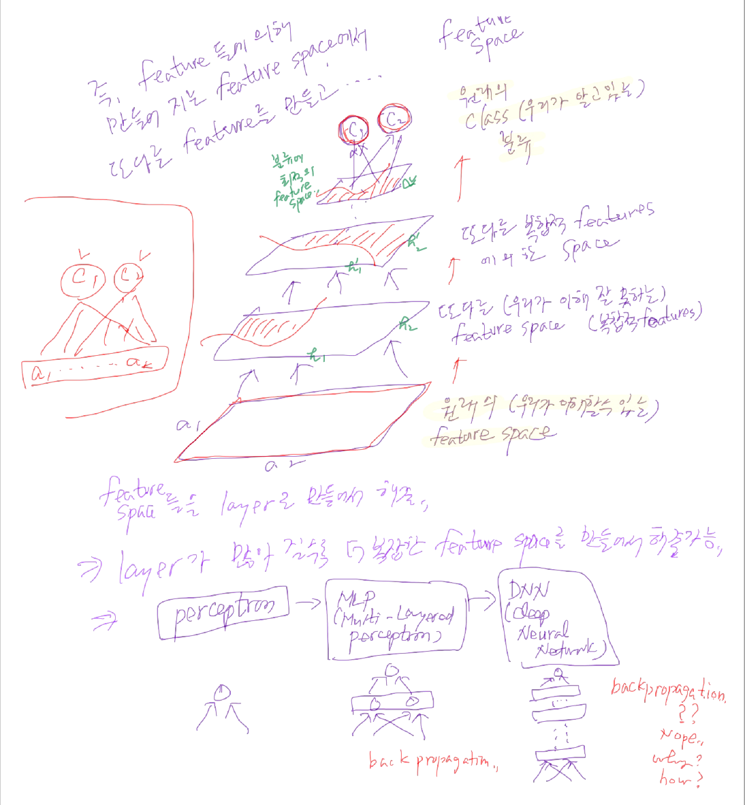

# Review

... 앞에 좀 더 있음

- Bayesian algorithms
- Regression
- Ensemble
  - Begging
  - Adaboost
  - Stacked generation

- Other Algorithms
  - Computational intelligence
  - Computer Vision
  - Natural Language Processing (NLP)
  - Recommendation Systems
  - Reinforcement Learning

분위기가 가라앉고 있다.

내년 상반기에 경직된다.

제일 좋은 것.. 대학원 가는 거에요. 대학원 진학률이 엄청나게 올라가요. 대학원 가기가 힘들어져요.

- Feature space
- Model

## 딥 뉴럴 네트워크

무엇이 이슈였고, 그 문제를 어떻게 해결했는지~

  

0와 3을 구분한다.

0과 1의 36개짜리 그리드로 만들어서 인풋으로 집어넣는다.

히든 노드 1개만 가지고도 다 classify할 수 있습니다. 문제가 많죠.

문제점:

1. 사람 얼굴, 고양이 사진 같은 건 어떻게?
2. 인쇄 글자가 아니면 어떻게 할래?
3. 모양이 rotated, shift, shrink 된다면? 따라서 확장성이 전혀 적용이 안된다.
   SVN도 나오고 여러가지 하다가~

석사논문:
이미지 데이터를 이렇게 넣지 말고, 패턴을 만들어서 패턴을 집어넣자~ 그게 교수님의 석사논문이다.

해결책 아이디어:

1. Layer를 많이 집어넣자. 우리가 모르는 feature들을 찾아내자.

  그런데, depth를 늘리니까 무슨 문제가 발생하냐면, 학습이 안돼요. 그래서 많은 사람들이 고민을 했어요.
  해결할 생각은 안하고, 한두개 가지고 많이 하는데 왜 해~

  우리가 아는 모든 문제는 히든 레이어 한 두개로도 할 수 있다. 이미지는 다루고 있지 않아요.
  Feature 들이 알려진 데이터는 MLP가 더 잘 돼요. 문제는 이미지나 텍스트 데이터인 거죠.
  그래서 이미지, 소리, text 데이터는 다루지 못했었어요.

2. 2006년, 2007년에 해결을 합니다. 3사람
   - Hinton
   - LeCun
   - Montreal someone

## Vanishing Gradient Problem

학습이 안 된 이유에요.

이 문제를 이 사람들이 해결을 합니다. 가장 대표적인 적용 사례가 CNN입니다.

Example이 좋은 게 있어요.

수업 끝나고 자료 드릴게요~

우와... 텐서플로 플레이그라운드 ㄸㄸㄸㄸㄸㄸㄸㄸㄸㄷ

Tanh는 된당 ㄸㄸㄸㄸㄸㄸㄸㄸㄸ

Relu 로 해볼까요? 된다 ㅇㅇㅇㅇㅇㅇㅇㅇㅇㅇㅇㅇㅇㅇㅇㅇㅇㅇㅇㅇㅇㅇㅇㅇㅇㅇ

Sigmoid로 하면 안된다는 거에요. 이런 문제들이에요. 그래서 지금 우리가 뉴럴 네트워크를 볼때 layer의 수 이런 것들은 이제 민감한 parameter 들이에요. Feature들이 다 정해진 정형 데이터들은 MLP가 나은데, feature를 모르면 layer를 늘려가면서 할 수가 있다. relu 나 이런 걸로 하면 학습이 된다~

자 여기까지 보고 다시 들어갈게요.

잘못된 Sigmoid 함수를 썼었구나. Weight 값이 0에 가까우면 훈련이 거의 안 일어나요. Computer가 너무 느려서
depth가 늘어나는 것을 어떻게 해볼 도리가 없어요.

Geoffrey Hinton's summary of findings

- x
- y
- z

Activation Functions

- Sigmoid
  
  학습이 된다.

- ReLU

    학습

- Leaky ReLU

    max(0.1x, x)

## Overfitting solutions

- More training data
- Dropout
- Regulariztion

## Convolutional Neural Network

Convolution은 무엇인가? LeCun

수표를 자동으로 인식하는 알고리즘이 있었어요. 그 아이디어를 가져와서 deep neural network를 적용해서 만들어냈습니다.
개념적으로 설명을 드리자면, 먼저 큰 이미지부터 봅시다.

구글에 convolution demo 검색

- Input image
- Convolution Kernel
- Feature map

이 데이터를 filter를 적용시킨다면 직선만, 수평만 나온다면 특징을 뽑아내는 것이다. 

이 아이디어를 어떻게 적용하나? 

